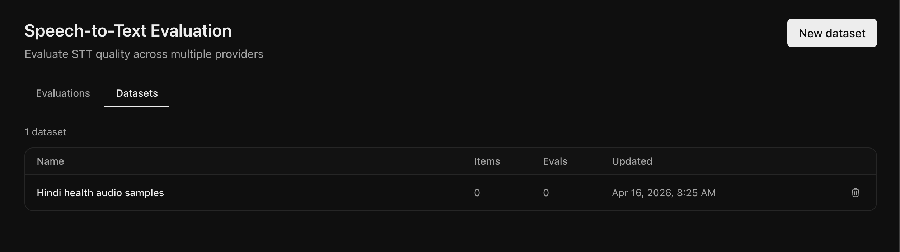
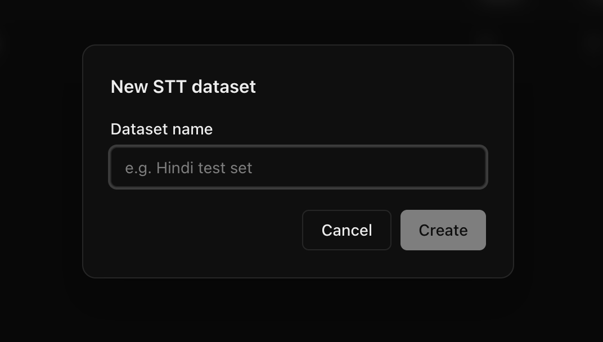
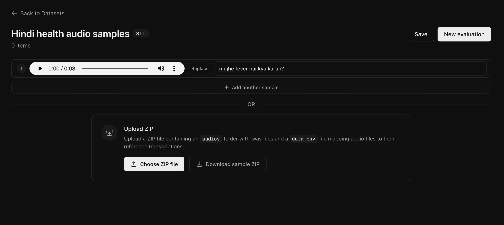

## Metrics

### Word Error Rate (WER)

Measures the edit distance between the predicted and reference transcripts at the word level. It calculates the minimum number of word insertions, deletions, and substitutions needed to transform the prediction into the reference, divided by the number of words in the reference.

- **Range**: 0 to infinity (0 is perfect, lower is better)
- **Limitation**: WER treats all word differences equally, even when the semantic meaning is preserved

#### Example

| Reference       | Prediction    | WER |
| --------------- | ------------- | --- |
| "Hello world"   | "Hello world" | 0.0 |
| "Hello world"   | "Hello there" | 0.5 |
| "one two three" | "1 2 3"       | 1.0 |

### String Similarity

Computes the ratio of matching characters between the normalized reference and prediction.

- **Range**: 0 to 1 (1 is perfect match, higher is better)
- **Use case**: Useful for catching character-level differences

#### Example

| Reference | Prediction | String Similarity |
| --------- | ---------- | ----------------- |
| "Geeta"   | "Geeta"    | 1.0               |
| "Geeta"   | "Gita"     | 0.8               |
| "Geeta"   | "John"     | 0.2               |

### LLM Judge Score

The LLM Judge uses a powerful LLM to semantically evaluate whether the transcription matches the source text. Unlike WER, it understands context and meaning.

- **Range**: 0 to 1 (1 means all transcriptions semantically match, higher is better)
- **Output**: Returns both a match (True/False) and reasoning for each audio file

#### Why LLM Judge is necessary

Traditional metrics like WER fail in cases where the transcription is semantically correct but textually different:

| Source                               | Transcription                        | WER              | LLM Judge                                |
| ------------------------------------ | ------------------------------------ | ---------------- | ---------------------------------------- |
| "1, 2, 3"                            | "one, two, three"                    | 1.0 (100% error) | True (same values)                       |
| "Rs. 500"                            | "Rupees five hundred"                | 1.0 (100% error) | True (same amount)                       |
| "Phone: 9833472990"                  | "Phone number is 98334 72990"        | 0.67 (67% error) | True (same number)                       |
| "Please write Rekha Kumari, sister." | "Please write Reha Kumari's sister." | 0.4 (40% error)  | False (name is different: Rekha vs Reha) |

#### LLM Judge Guidelines

- Numbers in different formats (digits vs words) are considered equivalent
- Word spacing differences are ignored
- Actual value differences (names, addresses, key details) are flagged as mismatches

## Datasets

You can save and manage your evaluation data as **datasets** for reuse across multiple evaluations — avoiding re-uploading the same audio files every time.

### View your datasets

From the **Speech-to-Text** page, click the **Datasets** tab.

<Frame>
  
</Frame>

### Create a dataset

Click **New dataset**, enter a name, and click **Create**.

<Frame>
  
</Frame>

You'll be taken to the dataset detail page where you can add samples in two ways:

<Frame>
  
</Frame>

1. **Add samples inline** — Click **Upload .wav** to attach an audio file and type the reference transcription for each row. Click **+ Add another sample** to add more rows.

2. **Bulk upload via ZIP** — Upload a ZIP file containing an `audios` folder with `.wav` files and a `data.csv` file mapping audio files to their reference transcriptions. Click **Download sample ZIP** to get a template with the correct structure.

Click **Save** to persist your changes.

### Update a dataset

Open an existing dataset from the **Datasets** tab to edit it. You can:

- **Add more samples** — Add new rows inline or upload another ZIP to append more audio samples.
- **Edit transcriptions** — Click on any reference transcription to update it.
- **Remove samples** — Click the delete button on a row to remove that sample.

Click **Save** after making changes to persist them.

<Note>
  Audio files for existing samples cannot be replaced — delete the sample and
  re-add it with the correct audio if needed.
</Note>

### Delete a dataset

From the **Datasets** tab, click the delete button next to a dataset to remove it entirely.

### Run an evaluation from a dataset

Once your dataset has samples, click the **New evaluation** button on the dataset page. This pre-selects the dataset and takes you to the evaluation settings where you choose the language and providers to compare.

## Next Steps

<CardGroup cols={2}>
  <Card title="Quickstart" icon="play" href="/quickstart/speech-to-text">
    Run your first evaluation on your dataset
  </Card>
</CardGroup>
