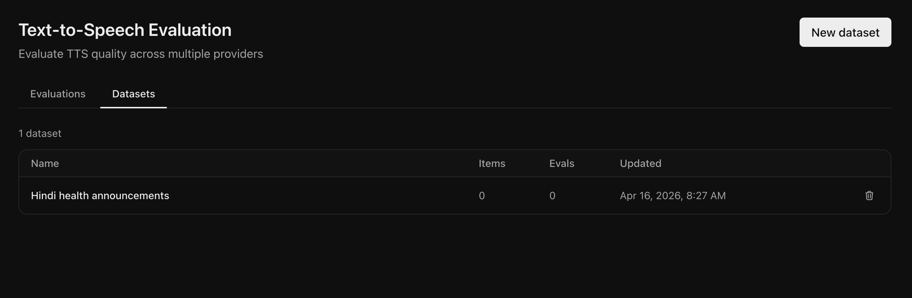
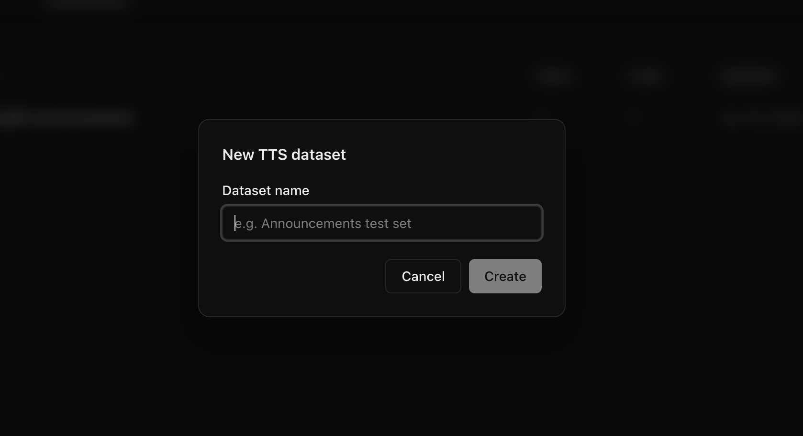
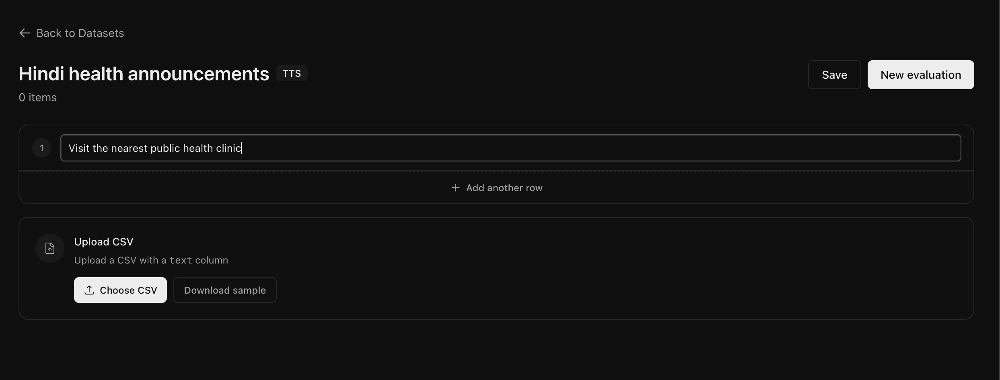

## Metrics

### LLM Judge Score

An audio LLM Judge (`gpt-audio`) listens to the generated audio and evaluates whether the pronunciation matches the input text.

<Note>
  The LLM Judge directly compares the raw audio against the input text. It does
  **not** convert the generated speech to text first — it evaluates the audio
  natively using an audio-capable model.
</Note>

<Warning>
  Evaluation accuracy may differ for low-resource languages like Sindhi, as the
  underlying audio model has limited training data for these languages.
</Warning>

- **Range**: 0 to 1 (1 means all audio correctly pronounces the text, higher is better)
- **Output**: Returns both a match (True/False) and reasoning for each audio file

What the LLM Judge evaluates:

- Correct pronunciation of words
- Proper handling of numbers, abbreviations, and special characters

#### Example

| Text                  | Audio                                                           | LLM Judge | Reasoning                                                        |
| --------------------- | --------------------------------------------------------------- | --------- | ---------------------------------------------------------------- |
| "Hello world"         | <audio controls src="/core-concepts/audios/hello_world.wav" />  | True      | The audio clearly says "hello world" with correct pronunciation. |
| "Call 1-800-555-0123" | <audio controls src="/core-concepts/audios/phone_number.wav" /> | True      | The phone number is pronounced correctly.                        |
| "Dr. Smith"           | <audio controls src="/core-concepts/audios/dr_smith.wav" />     | False     | "Dr." was pronounced as "dur" instead of "doctor".               |

### Time to First Byte (TTFB)

Measures the time (in seconds) from when the request is made to the provider until the first audio chunk is received. It is critical for real-time voice agents where responsiveness matters.

## Datasets

You can save and manage your text samples as **datasets** for reuse across multiple evaluations — avoiding re-entering the same text data every time.

### View your datasets

From the **Text-to-Speech** page, click the **Datasets** tab.

<Frame>
  
</Frame>

### Create a dataset

Click **New dataset**, enter a name, and click **Create**.

<Frame>
  
</Frame>

You'll be taken to the dataset detail page where you can add text samples in two ways:

<Frame>
  
</Frame>

1. **Add samples inline** — Type the text to synthesize in each row. Click **+ Add another row** to add more entries.

2. **Bulk upload via CSV** — Upload a CSV file with a `text` column containing your samples. Click **Download sample** to get a template with the correct format.

Click **Save** to persist your changes.

### Update a dataset

Open an existing dataset from the **Datasets** tab to edit it. You can:

- **Add more samples** — Add new text rows inline or upload another CSV to append more entries.
- **Edit text** — Click on any text sample to update it.
- **Remove samples** — Click the delete button on a row to remove that sample.

Click **Save** after making changes to persist them.

### Delete a dataset

From the **Datasets** tab, click the delete button next to a dataset to remove it entirely.

### Run an evaluation from a dataset

Once your dataset has samples, click the **New evaluation** button on the dataset page. This pre-selects the dataset and takes you to the evaluation settings where you choose the language and providers to compare.

## Next Steps

<CardGroup cols={2}>
  <Card title="Quickstart" icon="play" href="/quickstart/text-to-speech">
    Run your first evaluation on your dataset
  </Card>
</CardGroup>
